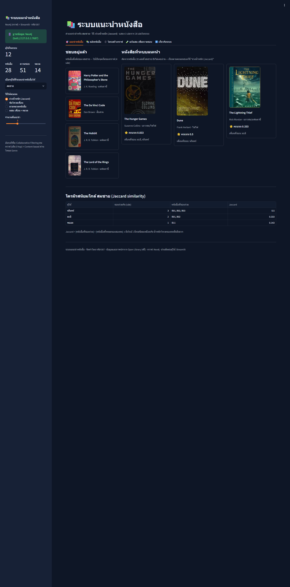
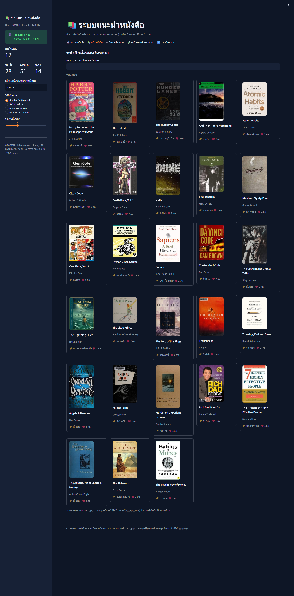

# 📚 ระบบแนะนำหนังสือ (Book Recommender System) — Neo4j + Streamlit

ระบบแนะนำ **หนังสือ** ที่พัฒนาขึ้นเอง (ข้อมูลชุดของเราเอง ไม่ใช่ dataset สำเร็จรูป)
ทำงานบน **ฐานข้อมูลกราฟ Neo4j** มี **การ์ดแสดงภาพปกหนังสือจริง** ในผลการแนะนำ
และมี **เว็บแอป Streamlit** ให้สาธิตการใช้งานสด + **Google Colab notebook** สำหรับอธิบายวิธีทำทีละขั้น

> จัดทำโดย **รหัส 007** · งาน: พัฒนาระบบแนะนำเป็นระบบของตัวเอง · ข้อมูล+ภาพปกจาก [Open Library](https://openlibrary.org) (ฟรี ไม่ต้องใช้ API key)

---

## 🔗 ลิงก์

| สิ่งที่ส่ง | ลิงก์ |
|---|---|
| 📓 โน๊ตบุ๊กอธิบายการทำงาน (Colab) | [เปิดใน Colab](https://colab.research.google.com/gist/Nasak16/247492673b9b3a74dd39bd7d442d398c/BookRecommender_Neo4j_007.ipynb) |
| 📒 ไฟล์ .ipynb สำหรับส่ง | [`notebooks/BookRecommender_Neo4j_007.ipynb`](notebooks/BookRecommender_Neo4j_007.ipynb) |
| 📊 สไลด์นำเสนอ (PowerPoint / PDF / PNG) | [`slides/`](slides) — 16 สไลด์ |
| 🖥️ เว็บแอปสาธิต | `py -3.13 -m streamlit run app.py` (ในเครื่อง) |
| 🗂️ หน้า index รวมงานทุกชิ้น | <https://nasak16.github.io/homework/> |

> ผลการรันในโน๊ตบุ๊กที่ฝังมาในไฟล์ มาจากการรันจริงกับ Neo4j ในเครื่องทดสอบ (เซลล์เชื่อมต่อยังคงเป็นบัญชี Neo4j Aura ของเรา พร้อมรหัสผ่านที่กรอกเองตอนรันบน Colab)

---

## ✨ ระบบทำงานอย่างไร

### โครงสร้างกราฟ
```
(User)-[:LIKES]->(Book)-[:IN_GENRE]->(Genre)
   12 คน            28 เล่ม              14 หมวด      51 ความสัมพันธ์
```

### ขั้นตอนการแนะนำ (เดิน 3 hop บนกราฟ)
1. `(ผู้ใช้)-[:LIKES]->(หนังสือ)` — ดูว่าผู้ใช้คนนี้ชอบอะไร
2. `(หนังสือ)<-[:LIKES]-(คนอื่น)` — หาคนที่ชอบหนังสือเล่มเดียวกัน = รสนิยมใกล้กัน
3. `(คนอื่น)-[:LIKES]->(หนังสือเล่มใหม่)` — เก็บเล่มที่ผู้ใช้ยังไม่ชอบ แล้วจัดอันดับ

### สูตรให้คะแนน 3 แบบ + 1 แบบผสม
- **นับโหวต** — `คะแนน = จำนวนคนที่ชอบเล่มนั้น` (1 คน = 1 เสียง)
- **ถ่วงน้ำหนักความคล้าย** — `คะแนน = Σ Jaccard(เรา, คนนั้น)` เมื่อ `Jaccard = |ชอบร่วม| ÷ |หนังสือของสองคนรวมกัน|`
- **ตามหมวดหนังสือ (content-based)** — นับหมวดที่ผู้ใช้ชอบผ่านโหนด `Genre` ช่วยแก้ cold start
- **ผสม (hybrid)** — คะแนนเพื่อน 60% + คะแนนหมวด 40% (normalize แล้ว)

### ตัวอย่างผลจริง (ผู้ใช้ สมชาย — ชอบ Harry Potter, The Hobbit, LOTR, Da Vinci Code)
| หนังสือที่แนะนำ | คะแนน | เพราะ |
|---|---|---|
| The Hunger Games | 0.833 | มะลิ (0.333) + นรินทร์ (0.500) ชอบร่วมกัน |
| Dune | 0.500 | นรินทร์ ชอบร่วม 3 เล่ม |
| The Lightning Thief | 0.333 | มะลิ ชอบร่วม 2 เล่ม |

---

## 🗂 โครงสร้างโปรเจกต์

```
book-recommender/
├── app.py                  # เว็บแอป Streamlit (5 แท็บ: แนะนำ/คลังหนังสือ/กราฟ/เดโมสด/เกี่ยวกับ)
├── recommender.py          # แกนระบบ: Cypher ทั้งหมด + คลาส BookRecommender
├── graph_fallback.py       # backend สำรอง (ในหน่วยความจำ) ใช้เมื่อไม่มี Neo4j
├── graph_view.py           # วาดกราฟ bipartite ด้วย networkx + matplotlib
├── data/
│   ├── seed_data.py        # ข้อมูลตั้งต้น: 12 ผู้ใช้ + 51 ความชอบ (แหล่งข้อมูลเดียวของทั้งระบบ)
│   └── books.json          # 28 เล่ม + ISBN + URL ปก (ดึงจาก Open Library)
├── assets/covers/          # ไฟล์ภาพปก 28 รูป (อยู่ในเครื่อง → แสดงได้แม้ไม่มีอินเทอร์เน็ต)
├── tools/                  # สคริปต์ช่วย: ดึงปก, โหลดเข้า Neo4j, ทดสอบ, ถ่ายภาพหน้าจอ
├── notebooks/              # โน๊ตบุ๊กสำหรับส่ง (Colab)
├── slides/                 # สไลด์นำเสนอ .pptx + .pdf + PNG ต่อสไลด์
└── shots/                  # ภาพหน้าจอแอปจริง (ใช้ในสไลด์และรายงาน)
```

---

## 🚀 วิธีรัน

### 1) Neo4j
- **ในเครื่อง (ทดสอบ)** — สคริปต์ตั้งค่าอยู่ใน `docs/local-neo4j.md`
- **Neo4j Aura (ฟรี)** — สร้าง instance แล้วโหลดข้อมูลด้วยคำสั่งเดียว:
  ```bash
  py -3.13 tools/load_neo4j.py neo4j+s://<instance-id>.databases.neo4j.io neo4j <password>
  ```

### 2) เว็บแอป
```bash
py -3.13 -m pip install -r requirements.txt
cp .streamlit/secrets.toml.example .streamlit/secrets.toml   # ใส่ค่า Neo4j ของเรา
py -3.13 -m streamlit run app.py
```
ถ้าเชื่อมต่อ Neo4j ไม่ได้ แอปจะสลับไปใช้ **backend สำรอง** อัตโนมัติ (ข้อมูลชุดเดียวกัน)
พร้อมแจ้งเตือนบนแถบด้านข้าง — หน้าจอและภาพปกยังทำงานครบถ้วน

### 3) ตรวจความถูกต้องของสอง backend
```bash
py -3.13 tools/consistency_test.py bolt://127.0.0.1:7687 neo4j <password>
# ผลที่ต้องได้: "ผลตรงกันครบทุกข้อ (12 คน × 5 การตรวจ)"
```

---

## 🧪 สิ่งที่ทดสอบแล้ว (ผลจริง)

| การทดสอบ | คำสั่ง | ผล |
|---|---|---|
| โหลดข้อมูลเข้า Neo4j | `tools/load_neo4j.py` | 12 ผู้ใช้ / 28 เล่ม / 51 LIKES / 14 Genre |
| ตรงกันระหว่าง Cypher กับ backend สำรอง | `tools/consistency_test.py` | ตรงกัน 12 คน × 5 การตรวจ |
| ภาพปกครบ 28 เล่ม | ตรวจด้วยสายตา (contact sheet) | ครบ ไม่มีรูปเปล่า/ผิดเรื่อง |
| แอปแสดงผลจริง | `tools/shots.py` (Playwright) | 6 ภาพหน้าจอ ทุกแท็บแสดงภาพปกครบ |

---

## 📷 ภาพหน้าจอ

| หน้าแนะนำหนังสือ | คลังหนังสือ (28 เล่ม) | โครงสร้างกราฟ |
|---|---|---|
|  |  |  |

---

## 🔐 ความปลอดภัยของข้อมูลเชื่อมต่อ
`.streamlit/secrets.toml` (รหัสผ่าน Neo4j) **ไม่ถูกอัปโหลดขึ้น GitHub** — อยู่ใน `.gitignore`
ในโปรเจกต์มีแค่ `.streamlit/secrets.toml.example` ให้ก็อปไปใช้